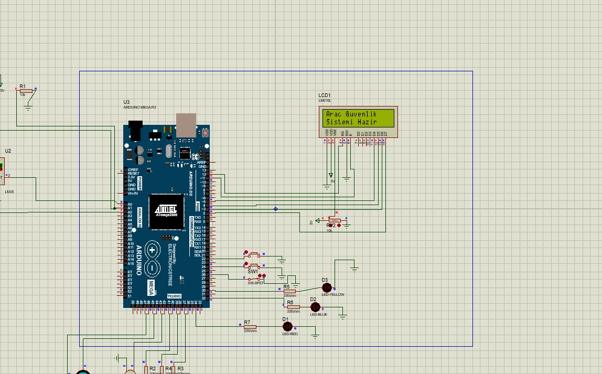
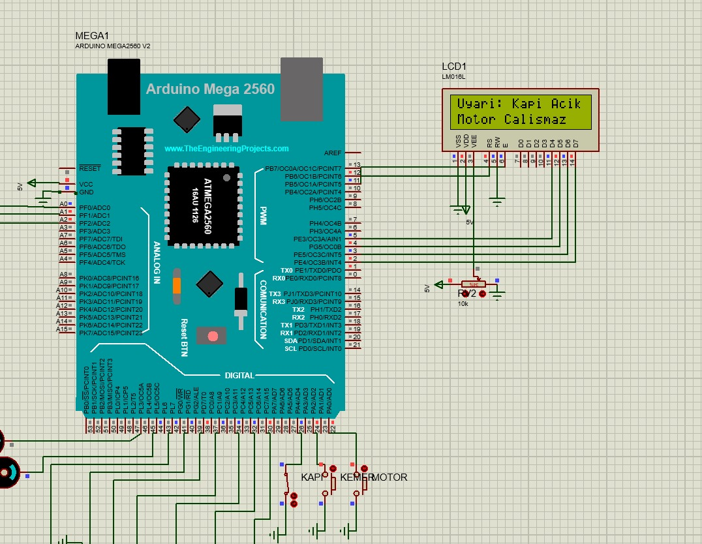
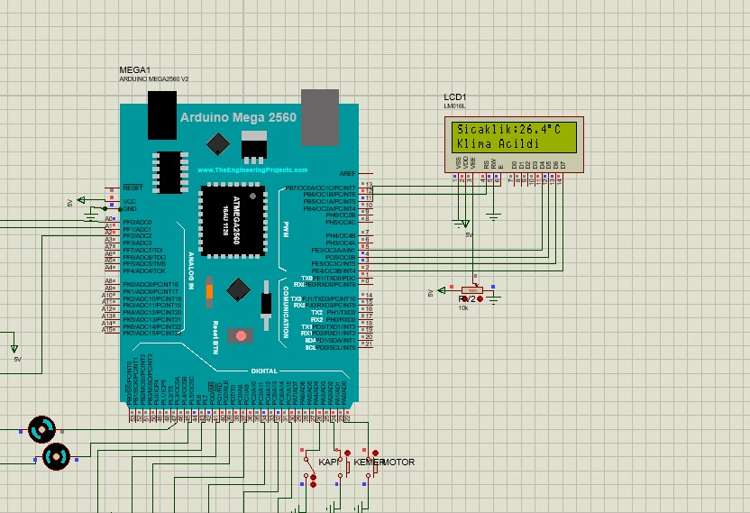
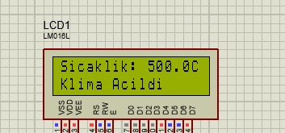
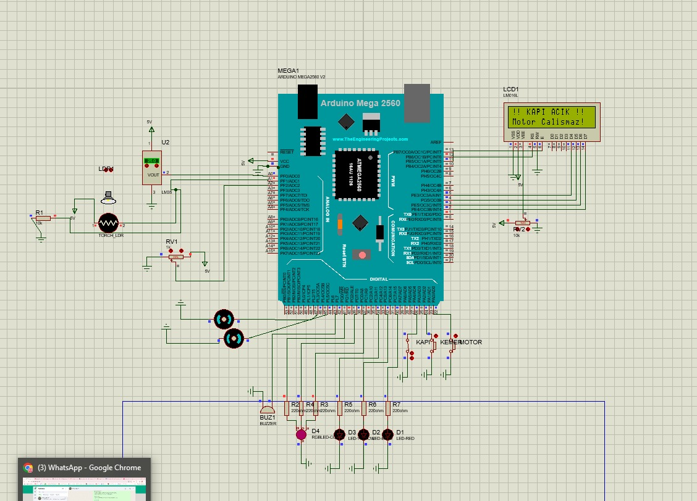
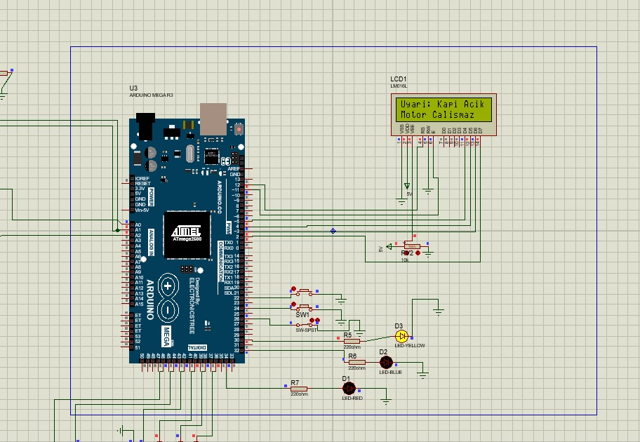
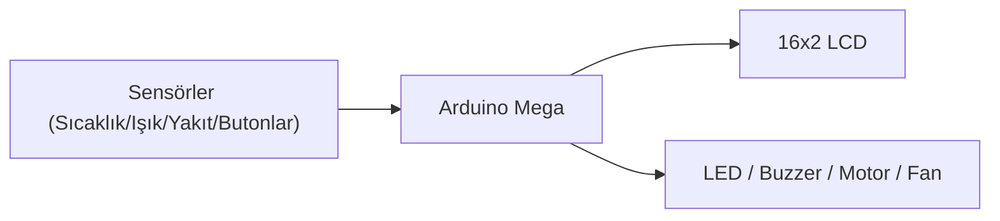

# Arduino Araç Kontrol Paneli

Arduino (Mega) tabanlı, bir arabanın gösterge panelini ve temel güvenlik mantığını simüle eden bir gömülü sistem projesi. Proteus'ta devre simülasyonu ile birlikte gelir.

## Ekran Görüntüleri (Proteus Simülasyonu)

| Sistem başlangıcı | Kapı açık uyarısı |
|---|---|
|  |  |

| Klima açıldı (sıcaklık eşiği) | Yüksek sıcaklık testi |
|---|---|
|  |  |

| Tam devre şeması | Uyarı detayı (LED'ler ile) |
|---|---|
|  |  |

## Mimari

## Özellikler

- **Motor kontrolü:** buton ile çalıştır/durdur; kapı açıkken veya yakıt bittiğinde motor otomatik durur
- **Emniyet kemeri uyarısı:** motor çalışırken kemer takılı değilse buzzer çalar, LED yanar
- **Kapı sensörü:** kapı açıkken RGB LED ile uyarı, motor otomatik durdurulur
- **Sıcaklık bazlı klima/fan kontrolü:** eşik sıcaklıkların üstünde/altında fan otomatik açılır/kapanır (histerezis ile)
- **Işık sensörüne göre otomatik farlar**
- **Yakıt seviyesi:** potansiyometre ile okunur, az/kritik/bitti durumlarında LED uyarıları (kritik seviyede yanıp söner)
- **16x2 LCD ekran:** öncelikli uyarılar ve genel durum bilgisi (yakıt %, sıcaklık, motor/far/klima durumu)

## Donanım

- Arduino Mega (veya uyumlu)
- 16x2 LCD (paralel, `LiquidCrystal` kütüphanesi)
- Butonlar: motor, emniyet kemeri, kapı anahtarı
- Sensörler: sıcaklık (analog), ışık/LDR (analog), yakıt potansiyometresi (analog)
- LED'ler: kemer, far, yakıt, RGB kapı LED'i
- Buzzer, motor çıkışı, fan çıkışı (röle/transistör üzerinden sürülmesi önerilir)

Pin tanımları için `.ino` dosyasının başındaki `#define` bloğuna bakın.

## Simülasyon

`proteus_simulasyonu.pdsprj` dosyasını Proteus Design Suite ile açarak devreyi simüle edebilirsiniz.

## Kurulum

Arduino IDE ile `arac_kontrol_paneli.ino` dosyasını açıp Arduino Mega'ya yükleyin.
